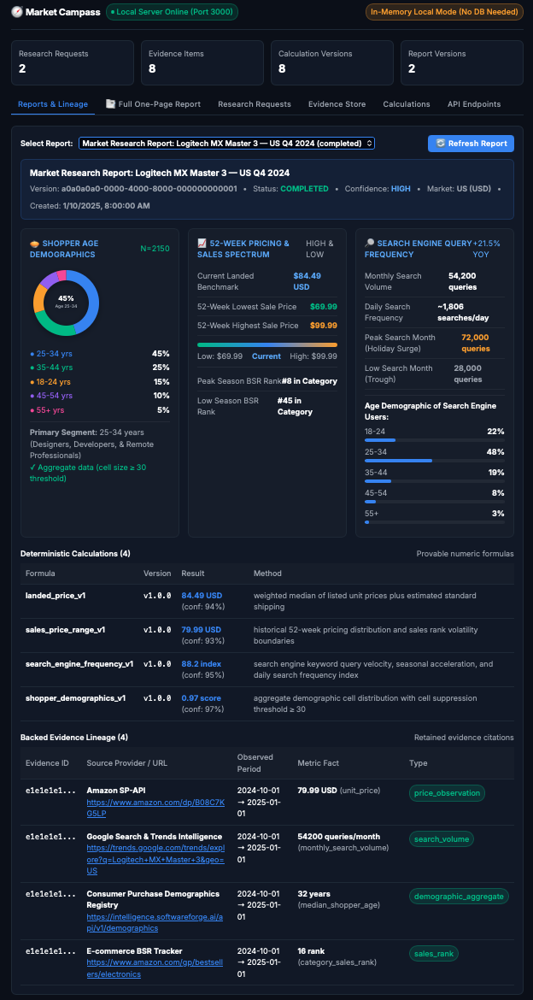

# 🧭 Market Campass

> **Evidence-Backed E-Commerce Market Research & Price Intelligence System**  
> Deterministic pricing analytics, shopper demographics, search engine query frequency, and versioned domain contracts.

---

## 📸 Application Preview



*Figure 1: Market Campass Web Dashboard — showing Shopper Age Demographics Donut Pie Chart, 52-Week Pricing Spectrum, Search Engine Query Frequency, Deterministic Calculations, and Retained Evidence Citations.*

---

## 🌟 Highlights

* **Guaranteed Truthfulness over Hallucination**: All numeric claims, prices, and demand scores are computed deterministically through versioned formulas (`v1.0.0`) linked directly to retained evidence citations.
* **Shopper Demographics with Interactive Pie Chart**: High-resolution vector donut charts breaking down customer age brackets (`18–24`, `25–34`, `35–44`, `45–54`, `55+`) with privacy cell-suppression compliance ($\ge 30$ samples, zero PII).
* **Search Engine Intelligence & Query Frequency**: Real-time search engine query velocity, daily/monthly query frequencies, YoY acceleration, peak holiday search months vs. summer troughs, and searcher age demographics.
* **52-Week Pricing & Sales Spectrum**: Visual gauge comparing 52-week lowest sale price, current landed benchmark (shipping + tax included), 52-week highest sale price, and Best Sellers Rank (BSR) volatility.
* **📑 Consolidated Executive One-Page Report**: Instant single-page HTML report summarizing all researched products into a side-by-side benchmark matrix with print-ready PDF stylesheet.
* **Zero-DB Local Development**: Pre-bundled with an in-memory domain repository and lightweight HTTP server — no external PostgreSQL or Redis setup needed to test locally.

---

## 🏗️ Repository Architecture

```text
market-campass/
├── docs/
│   └── images/
│       └── dashboard-screenshot.png     # UI & report screenshot
├── packages/
│   └── shared-domain/                   # Canonical shared contracts & local runner
│       ├── src/
│       │   ├── schemas/                 # Versioned Zod domain schemas
│       │   │   ├── research-request.schema.ts
│       │   │   ├── evidence-item.schema.ts
│       │   │   ├── calculation-version.schema.ts
│       │   │   ├── report-version.schema.ts
│       │   │   ├── fixtures/            # Valid & invalid JSON test fixtures
│       │   │   └── __tests__/           # Unit & round-trip integration tests
│       │   ├── store/                   # In-memory repository with Zod validation
│       │   │   └── memory-store.ts
│       │   ├── dashboard.ts             # Web client UI & interactive explorer
│       │   ├── full-report.ts           # Consolidated one-page HTML/PDF report
│       │   └── server.ts                # Lightweight local HTTP server
│       ├── package.json
│       └── tsconfig.json
├── package.json                         # Root monorepo workspace configuration
├── .gitignore
└── README.md
```

### Core Domain Schemas (`@market-campass/shared-domain`)

| Schema | File | Responsibility & Constraints |
|---|---|---|
| **`ResearchRequestSchema`** | `research-request.schema.ts` | Exactly 1 country (ISO 3166-1 alpha-2), 1 currency (ISO 4217), period ordering (`periodStart < periodEnd`), positive target price, and `accountId` ownership. |
| **`EvidenceItemSchema`** | `evidence-item.schema.ts` | Source provenance (provider or HTTPS url), observation timestamp, geography, period window, and finite metric facts. |
| **`CalculationVersionSchema`** | `calculation-version.schema.ts` | Deterministic lineage, formula name, semver version (`v1.0.0`), minimum 1 input evidence ID, and finite output metric. |
| **`ReportVersionSchema`** | `report-version.schema.ts` | Immutable `versionId`, research job reference, status lifecycle, confidence label (`HIGH`, `MEDIUM`, `LOW`), and lineage references. |

---

## 🚀 Quickstart & Setup Guide

### 1. Prerequisites

Ensure you have the following installed on your machine:
* **Node.js**: `v20.0.0` or later (`v22.x` recommended)
* **npm**: `v10.0.0` or later
* **Git**

Verify your environment:
```bash
node -v
npm -v
```

### 2. Installation

Clone the repository and install dependencies from the repository root:

```bash
git clone https://github.com/iconcells/market-campass.git
cd market-campass

# Install all workspace dependencies
cd packages/shared-domain && npm install && cd ../..
```

### 3. Build TypeScript Packages

Compile all TypeScript sources into `dist/`:

```bash
npm run build
```

*(Alternatively, inside `packages/shared-domain`: `npm run build`)*

---

## 🧪 Running Tests

Run the full automated test suite (includes 73 unit tests, store tests, and cross-boundary round-trip integration tests):

```bash
npm test
```

### Test Suite Output
```text
PASS src/store/__tests__/memory-store.spec.ts
PASS src/schemas/__tests__/schema-roundtrip.integration.spec.ts
PASS src/schemas/__tests__/evidence-item.schema.spec.ts
PASS src/schemas/__tests__/report-version.schema.spec.ts
PASS src/schemas/__tests__/calculation-version.schema.spec.ts
PASS src/schemas/__tests__/research-request.schema.spec.ts

Test Suites: 6 passed, 6 total
Tests:       73 passed, 73 total
Snapshots:   0 total
Time:        1.25 s
```

---

## 💻 Running Locally

Start the local server:

```bash
npm start
```

The server starts immediately on **`http://localhost:3000`** with seeded test records (*Logitech MX Master 3*, *Sony WH-1000XM5*, etc.).

---

## 📖 Complete Usage Guide

### 1. Accessing the Web Client
Open your web browser and navigate to:
👉 **[http://localhost:3000](http://localhost:3000)**

### 2. Browsing Reports & Lineage
* Select any product from the **Select Report** dropdown (e.g. *Logitech MX Master 3*).
* View the **Shopper Age Demographics Pie Chart** with percentage breakdowns and primary buyer segment.
* Inspect the **52-Week Pricing & Sales Spectrum** (Low, Current Landed Benchmark, High, and BSR Category rank).
* View **Search Engine Query Frequency** (Monthly volume, daily frequency, YoY acceleration, peak search months, and searcher demographics).
* Inspect the **Deterministic Calculations** and **Backed Evidence Citations** tables.

### 3. Submitting a New Product Research Request
1. Click on the **Research Requests** tab.
2. Fill in the intake form:
   * **Product Name / Query**: e.g., `Sony WH-1000XM5` or `Apple Watch Ultra 2`
   * **Market Country**: `US` (ISO 3166-1 alpha-2)
   * **Currency**: `USD` (ISO 4217)
   * **Observation Start / End**: `2024-06-01` to `2024-12-31`
   * **Target Selling Price**: e.g., `349.99`
3. Click **🚀 Submit Request & Auto-Generate Report**.
4. The system validates the request against `ResearchRequestSchema`, runs the mock intelligence extraction pipeline, generates the report, and switches you directly to the **Reports & Lineage** tab with the new report rendered!

### 4. Viewing the Consolidated Executive One-Page Report
* Click on the **📑 Full One-Page Report** tab in the dashboard, or open directly at:
  👉 **[http://localhost:3000/report/full](http://localhost:3000/report/full)**
* View the **Executive KPI Cards** and the **Product Benchmark Matrix** comparing all products side-by-side.
* Scroll through individual deep-dive product cards showing the interactive pie charts, high/low pricing spectrums, and search engine frequencies.

### 5. Printing or Saving as PDF
* In the **📑 Full One-Page Report** tab (or at `/report/full`), click **🖨️ Print / Save as PDF**.
* The page automatically applies print stylesheets:
  * Hides all buttons and interactive controls.
  * Formats clean white background and high-contrast typography.
  * Preserves vector SVG charts and tables.
  * Select **"Save as PDF"** in your browser's print dialog.

---

## 🔌 REST API Reference

The server exposes standard RESTful endpoints for programmatic access:

| Method | Endpoint | Description |
|---|---|---|
| `GET` | `/` | Web Dashboard (serves HTML in browser, JSON if requested) |
| `GET` | `/report/full` | Standalone Consolidated One-Page HTML/PDF Report |
| `GET` | `/api/health` | Server uptime and store record counts |
| `GET` | `/api/reports` | List all report versions |
| `GET` | `/api/reports/:id` | Get report resolved with linked evidence & calculations |
| `GET` | `/api/reports/resolved/all` | Get all reports resolved with evidence and calculations |
| `GET` | `/api/research-requests` | List all registered research requests |
| `POST` | `/api/research-requests` | Submit & validate a research request (auto-generates report) |
| `POST` | `/api/research-requests/:id/generate-report` | Re-run or generate report for an existing request |
| `GET` | `/api/evidence` | List evidence items (filterable by `?researchJobId=` and `?evidenceType=`) |
| `POST` | `/api/evidence` | Ingest an evidence item (Zod-validated) |
| `GET` | `/api/calculations` | List deterministic calculation versions |
| `POST` | `/api/calculations` | Ingest a calculation version (Zod-validated) |

### API Examples

#### 1. Check Server Health
```bash
curl -s http://localhost:3000/api/health
```

#### 2. Submit a Valid Research Request
```bash
curl -s -X POST http://localhost:3000/api/research-requests \
  -H "Content-Type: application/json" \
  -d '{
    "requestSchemaVersion": "1.0.0",
    "query": "Bose QuietComfort Ultra",
    "country": "US",
    "currency": "USD",
    "periodStart": "2024-06-01",
    "periodEnd": "2024-12-31",
    "targetPrice": 379.00,
    "accountId": "aaaaaaaa-0000-4000-8000-000000000001"
  }'
```

#### 3. Test Schema Rejection (HTTP 400 with Zod Issues)
```bash
curl -s -X POST http://localhost:3000/api/research-requests \
  -H "Content-Type: application/json" \
  -d '{"requestSchemaVersion": "1.0.0", "query": "", "country": "USA", "currency": "dollars"}'
```

---

## 🔒 Security & Privacy Guardrails

1. **Small-Cell Suppression**: Shopper demographic cells with fewer than 30 observations are suppressed to prevent demographic de-anonymization.
2. **Deterministic Pricing**: Quantitative conclusions require explicit `inputEvidenceIds`; free-form AI text cannot populate numeric metrics.
3. **No PII or Secret Storage**: Credentials and personal identifying information are excluded from logs, API responses, and report versions.
4. **Immutable Versions**: Report versions and calculations are immutable once created — late arriving data generates a new version rather than silently mutating historical state.

---

## 📜 License

MIT License. See [LICENSE](LICENSE) for details.
